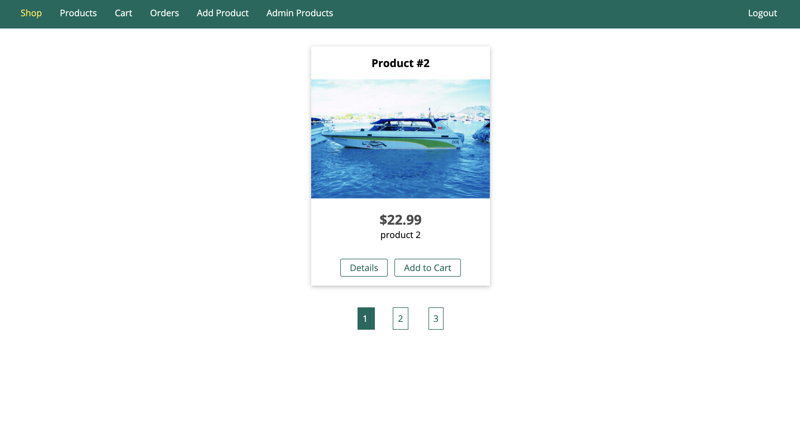

# myShop




## Requirement
 - MongoDB atlas 
 - Sendgrid
 - Stripe

## Feature
 - Authentication 
 - Email and Password validation
 - sign up and login
 - shopping cart  
 - upload your product for sell
 - payments
 
 ## usage 
 
 Clone it !!!
 
 ```
 $ git clone git@github.com:goby-lang/sample-web-app.git 
 ```
  
 assign your mongoDB database, Sendgrid and Stripe APIs keys.
 
 
  Start the server
 
 ```
 $ npm start
 ```
 
 Open `http://localhost:3000` or visit `https://pal-shop-app.herokuapp.com/` and enjoy!!!!
 
 
